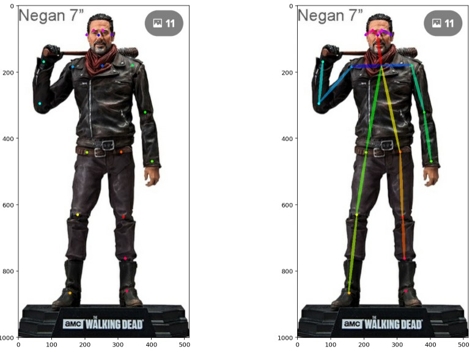

# My Projects

# [Image Segmentation | fastai Unet](https://github.com/billumillu/Image-Segmentation-fastai-Unet)
This implementation uses fastai's UNet model, where the CNN backbone (e.g. ResNet) is pre-trained on ImageNet and hence can be fine-tuned with only small amounts of annotated training examples.
## Data
In this notebook, we use a toy dataset specified in DATA_PATH which consists of 129 images of 4 classes of beverage containers {can, carton, milk bottle, water bottle}. For each image, a pixel-wise ground-truth mask is provided for training and evaluation.
## Model Performance

## Test Image

# [Object Detection | FasterRCNN](https://github.com/billumillu/Object-Detection-FasterRCNN)
This repository uses torchvision's Faster R-CNN implementation which has been shown to work well on a wide variety of Computer Vision problems.
For the DetectionLearner, we use Faster R-CNN as the default model, and Stochastic Gradient Descent as our default optimizer.
Our Faster R-CNN model is pretrained on COCO, a large-scale object detection, segmentation, and captioning dataset that contains over 200K labeled images with over 80 label cateogories.
## Data
In this notebook, we use a toy dataset called Fridge Objects, which consists of 134 images of 4 classes of beverage container {can, carton, milk bottle, water bottle} photos taken on different backgrounds.
## Output

# [Pose Estimation | pytorch](https://github.com/billumillu/Pose-Estimation-pytorch)
I used a custom pre-trained model. It was trained on the COCO dataset (250,000 people with keypoints - 42.7GB!).

My goal for this project was to get a simple model that will give me the pose for a human body. I plan to later use this in another project. The idea is to classify people based on their pose into - attackers, victims. This could help in preventing/controlling crimes. I currently need to learn about video analytics, and collect data (crime videos) for this project. Then, I will integrate it with this model.
## Output

